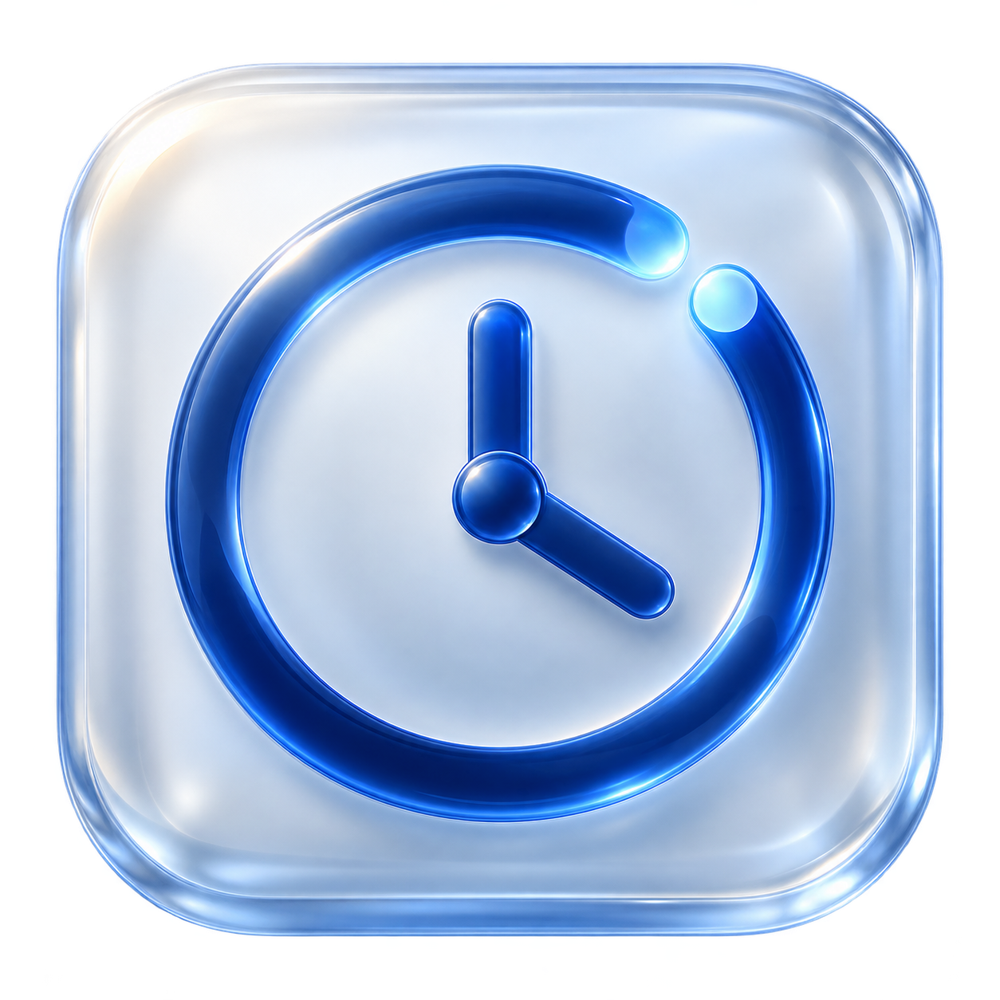
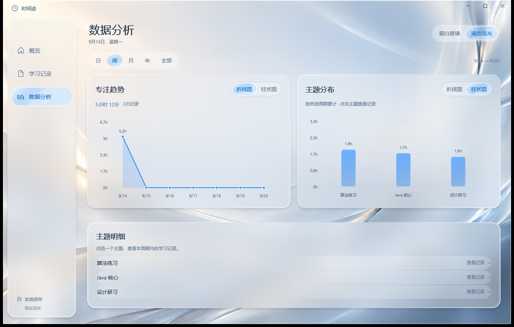
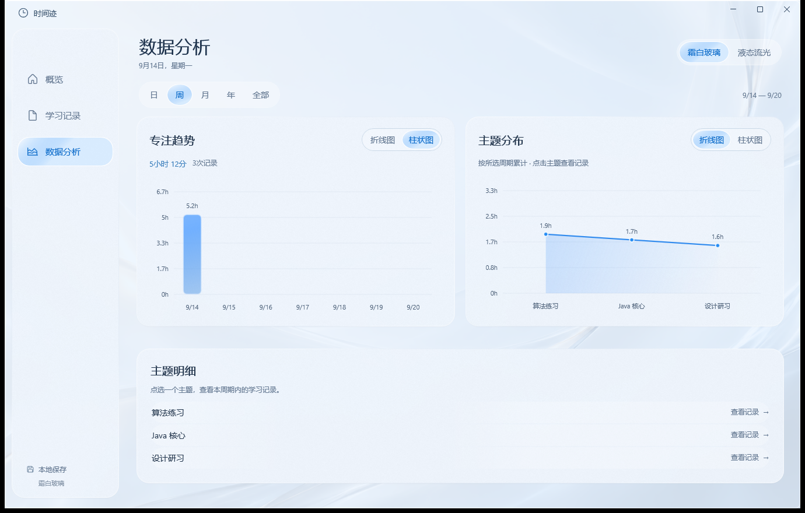

<div align="center">
  
  <h1>时间迹 · PrivateTimeTrace</h1>
  <p>让每一次专注，都留下清晰的痕迹。</p>
  <p>Windows 原生学习计时 · 本地数据 · 双玻璃风格 · 可切换图表</p>
  <p>
    <a href="https://github.com/fplity/PrivateTimeTrace/releases/latest">下载安装包</a> ·
    <a href="#功能">功能</a> ·
    <a href="#开发与构建">开发</a> ·
    <a href="LICENSE">MIT 许可</a>
  </p>
</div>



时间迹是一款专注于「记录学习 → 回顾投入 → 观察趋势」的 Windows 桌面应用。使用 **C# + .NET 10 + WinUI 3 + MVVM + SQLite** 构建，不是网页套壳，也不是手机 APK。

无需账号，没有双端同步。应用自己不上传学习记录、不接入广告或行为分析服务。

## 安装

前往 [Releases](https://github.com/fplity/PrivateTimeTrace/releases/latest)，下载：

| 文件 | 用途 |
| --- | --- |
| `PrivateTimeTrace-1.0.0-win-x64-Setup.exe` | 推荐：安装到当前用户，提供开始菜单入口、可选桌面快捷方式和卸载入口 |
| `PrivateTimeTrace-1.0.0-win-x64.zip` | 免安装文件夹：完整解压后打开 `PrivateTimeTrace.exe`，不能只复制 exe |
| `SHA256SUMS.txt` | 下载文件的 SHA-256 校验值 |

已包含 .NET 和 Windows App SDK 运行组件，不需要安装开发环境、开启开发者模式或导入测试证书。首次公开版本**没有商业代码签名证书**，Windows 可能提示未知发布者；请只使用本仓库 Release 的文件，并核对哈希。不要为安装程序关闭系统安全防护。

推荐 Windows 11 x64；应用配置的最低系统为 Windows 10 1809（17763），尚未实机覆盖全部 Windows 10 版本。底层运行库的支持范围还受[微软系统支持策略](https://github.com/dotnet/core/blob/main/release-notes/10.0/supported-os.md)约束。当前只提供 x64 包，不宣称已验证 ARM64、x86 或 Windows Server。

默认安装目录：`%LOCALAPPDATA%\Programs\PrivateTimeTrace`。升级前先退出应用；卸载保留学习数据库，不递归清空用户目录。当前版本没有后台自动更新器，请从 Releases 手动下载更新。

## 功能

- **专注计时**：输入学习主题，开始计时，结束后保存。关闭窗口不会自动结束学习，下次打开会恢复进行中的计时。
- **记录回顾**：查看历史记录、按主题查看记录；删除前二次确认。
- **一致的统计口径**：今日 / 本周累计，日、周、月、年、全部五种分析范围；跨午夜记录按实际重叠时间分配。
- **两个图表，独立切换**：「专注趋势」和「主题分布」各自支持折线图 / 柱状图，不绑定固定样式。偏好自动保存。
- **两套玻璃风格**：右上角随时切换「液态流光」与「霜白玻璃」，重启后保留选择。
- **适应窗口大小**：窄窗口压缩导航、上下排列图表；滚动时风格入口仍可访问。

这是本地计时与分析工具：当前没有账号、云同步、移动端联动、提醒服务或导入 / 导出面板。备份请使用下方的文件方式。

### 霜白玻璃



以上是带隔离演示数据的真实运行截图，不是概念图。界面采用 WinUI 原生 Acrylic、玻璃亮边、层级阴影、指针高光与轻量动效。它是独立的 Windows 视觉设计，并非苹果私有 Liquid Glass 渲染器，也不代表与 Apple 或 Microsoft 存在隶属或背书关系。系统关闭动画 / 高级效果时会减少特效。

## 数据与隐私

数据存储在：

```text
%LOCALAPPDATA%\PrivateTimeTrace\private-time-trace.db
```

数据库包含学习主题、开始 / 结束时间、活动计时和界面偏好。它没有应用级加密，具有本地账户访问权限的人可能读取它。

备份前请关闭所有时间迹窗口，再复制该数据目录（包括可能存在的 `-wal` / `-shm` 文件）。恢复时同样先退出应用，先备份原目录，再恢复自己的备份。安装、升级、卸载不会主动删除该数据目录。

完整说明见 [隐私说明](PRIVACY.md)。操作系统及微软运行组件的诊断行为由它们各自的设置和隐私条款约束。

## 开发与构建

需要 Windows x64、PowerShell 7、.NET SDK 10.0.401（允许同功能带补丁更新），首次构建需要联网还原 NuGet 包。依赖版本记录在 `packages.lock.json`；无需安装 Node、Java 或 Android SDK。

```powershell
dotnet restore PrivateTimeTrace.csproj -p:Platform=x64 -r win-x64 --locked-mode
dotnet build PrivateTimeTrace.csproj -c Debug -p:Platform=x64 -r win-x64
& '.\bin\x64\Debug\net10.0-windows10.0.26100.0\win-x64\PrivateTimeTrace.exe'
```

生成自包含程序、NSIS 安装包、免安装 ZIP 与校验文件：

```powershell
pwsh -NoProfile -File tools/build-release.ps1
```

输出到 `artifacts/releases/v1.0.0/`。脚本使用新目录，拒绝覆盖现有发布产物。NSIS 3.12 在项目 `.tools/` 内按固定 SHA-256 下载，不进行系统级安装。构建说明和静默安装参数见 [发布指南](docs/releasing.md)。

### 验证

```powershell
dotnet run --project tests/PrivateTimeTrace.Checks/PrivateTimeTrace.Checks.csproj -c Release
pwsh -NoProfile -File tools/verify-ui.ps1 -FixturePath "$PWD\artifacts\qa\new-ui-check.db"
pwsh -NoProfile -File tools/verify-installer.ps1 -InstallerPath "$PWD\artifacts\releases\v1.0.0\PrivateTimeTrace-1.0.0-win-x64-Setup.exe"
```

核心检查覆盖时间裁剪、统计一致性、SQLite 迁移、计时恢复与偏好保存。UI 验证需已登录的交互桌面，使用隔离数据库；请不要操作验证中的测试窗口。安装测试使用独立安装目录和注册表项，不向真实数据写入演示记录。

验证边界和本次执行结果见 [UI 验证记录](docs/verification-report.md)及[发布验证记录](docs/release-verification.md)。CI 构建成功不等于所有 Windows 设备均通过实际界面验证。

## 项目结构

```text
Controls/      原生玻璃容器、图表与动效
Data/          SQLite 数据存储与模型
Services/      时间区间和统计计算
ViewModels/    MVVM 页面状态
Themes/        视觉样式
Assets/        图标和背景素材
tests/         隔离数据层检查
packaging/     Windows 安装器定义
tools/         构建、许可收集和验证脚本
licenses/      第三方许可原文与依赖清单
```

## 许可与致谢

项目原创代码及可许可的原创资源采用 [MIT License](LICENSE)，版权声明为 `Copyright (c) 2026 fplity`。允许按 MIT 条件使用、修改和分发，请保留许可与版权声明。

**MIT 不会把第三方运行库重新授权为 MIT。** 自包含安装包里的 .NET、Windows App SDK、WebView2 等组件保留各自许可；完整条款与版权声明随安装包分发，并保存在 [licenses](licenses/README.md)。详情见 [第三方声明](THIRD_PARTY_NOTICES.md)。

功能方向参考同作者的 [ToutouTime](https://github.com/fplity/ToutouTime)，本项目是独立的 Windows 实现，不共享账号或同步数据。使用 CommunityToolkit.Mvvm、Microsoft.Data.Sqlite、SQLitePCLRaw 与 NSIS 等开源工具。图标、背景及概念参考图使用 AI 图像生成工具制作，详见[素材说明](docs/asset-provenance.md)。

欢迎提交 [Issue](https://github.com/fplity/PrivateTimeTrace/issues) 或 Pull Request。参与前请阅读 [贡献指南](CONTRIBUTING.md)和[安全说明](SECURITY.md)。
