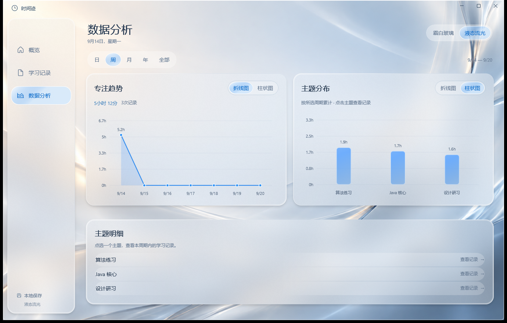
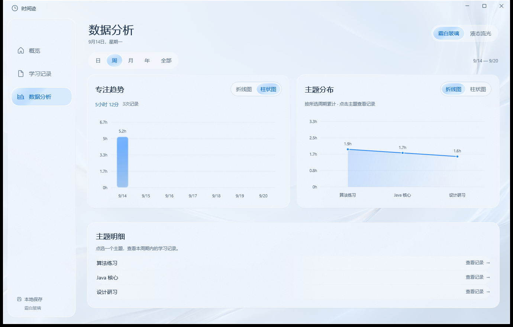
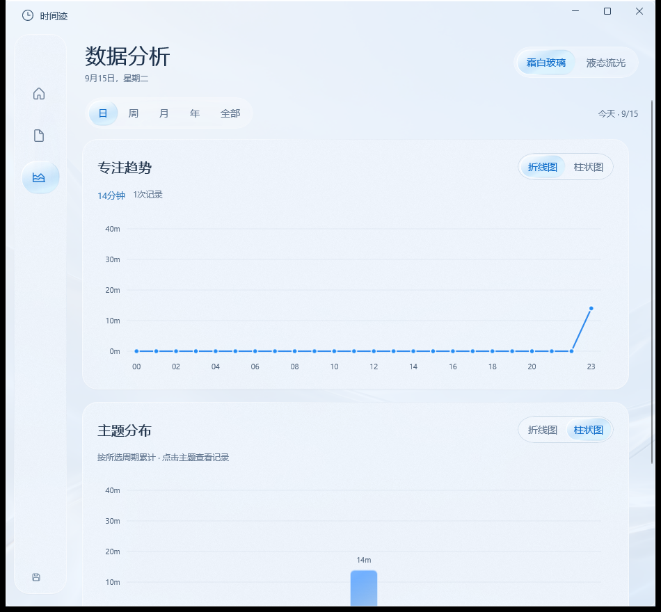
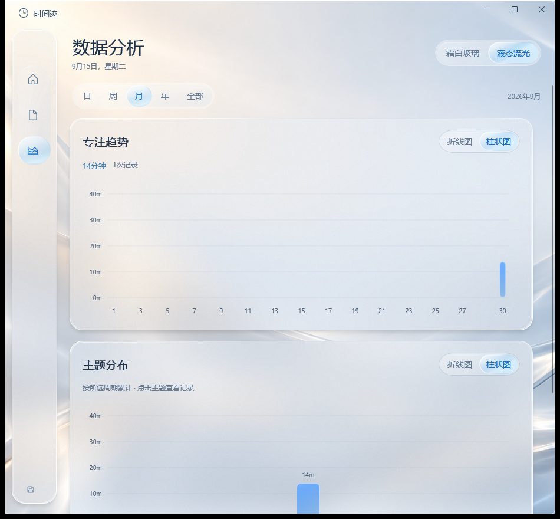

<div align="center">
  
  <h1>时间迹 · PrivateTimeTrace</h1>
  <p>记录每一次专注，看见时间如何积累。</p>
  <p>Windows 原生学习计时与可视化 · 本地存储 · 双玻璃风格</p>
  <p>
    <a href="https://github.com/fplity/PrivateTimeTrace/releases/latest">下载安装包</a> ·
    <a href="docs/user-guide.md">使用手册</a> ·
    <a href="docs/architecture.md">技术架构</a> ·
    <a href="CHANGELOG.md">更新记录</a> ·
    <a href="https://github.com/fplity/PrivateTimeTrace/issues">问题反馈</a>
  </p>
</div>



时间迹是一款面向个人学习与自我复盘的 Windows 桌面应用。填写学习主题，开始专注，结束后保存记录，再通过时间趋势和主题分布回顾自己的投入。它把日常使用集中在三个页面：**概览、学习记录、数据分析**，让记录与回顾形成一个简单的循环。

项目采用 **C# + .NET 10 + WinUI 3 + MVVM + SQLite**。窗口、导航、输入框、按钮和图表使用 Windows 原生界面技术实现；数据保存在当前 Windows 用户的本机目录中。使用核心计时与统计功能无需注册账号或连接学习数据服务。

界面提供「液态流光」与「霜白玻璃」两种风格，结合通透面板、柔和光影和按钮内的液态选择动效。两张图表分别支持折线图与柱状图，用户可以自由组合，并在下次启动时恢复显示偏好。

当前公开版本为 **[v1.1.1](https://github.com/fplity/PrivateTimeTrace/releases/tag/v1.1.1)**，提供 Windows x64 安装包、免安装 ZIP 和 SHA-256 校验文件。该版本修复了日、月趋势图后半段数据在卡片内默认不可见的问题。

## 目录

- [项目定位](#项目定位)
- [核心功能](#核心功能)
- [界面与交互](#界面与交互)
- [下载与安装](#下载与安装)
- [快速开始](#快速开始)
- [统计与图表规则](#统计与图表规则)
- [数据存储与隐私](#数据存储与隐私)
- [技术栈与项目结构](#技术栈与项目结构)
- [开发与构建](#开发与构建)
- [验证与质量边界](#验证与质量边界)
- [常见问题](#常见问题)
- [版本与文档](#版本与文档)
- [参与贡献](#参与贡献)
- [许可与致谢](#许可与致谢)

## 项目定位

时间迹关注两个问题：**今天实际学了多久，长期把时间用在了什么地方？**

它适合课程学习、编程练习、阅读、语言学习和个人技能训练。你可以用「Java 核心」「算法练习」「英语阅读」等主题持续记录，在一周或一个月后检查投入是否符合自己的计划。

项目的使用原则是：

- **少量操作完成记录**：开始时写下主题，结束时保存，自动生成时间与时长信息。
- **数据留在本机**：学习记录、活动计时和显示偏好由本地 SQLite 保存。
- **统计可以解释**：跨午夜和跨周期的记录按实际重叠时间分配，不把整条记录全部归到开始日期。
- **显示方式由用户选择**：视觉风格与两张图表的类型可以分别切换。
- **交互反馈集中在控件**：按钮提供形变、回弹与局部高光，让当前选择容易辨认。

当前功能范围是个人本地学习计时与分析。**账号、云同步、手机联动、暂停计时、番茄钟、提醒、目标管理、手动补录、记录编辑和应用内导入／导出尚未提供。**这些内容不属于已经实现的功能承诺。

## 核心功能

| 模块 | 已实现的能力 | 使用说明 |
| --- | --- | --- |
| 专注计时 | 填写主题、开始专注、结束并保存 | 一次活动计时；主题可留空，界面显示为「未命名学习」 |
| 计时恢复 | 本地保存活动计时的主题和开始时间 | 关闭应用后再次打开，可以继续原来的计时 |
| 概览 | 当前计时、今日累计、本周累计、图表与最近记录 | 最近记录展示最新的 3 条已完成学习记录 |
| 学习记录 | 查看主题、开始时间和完整时长；删除单条记录 | 删除前需要确认，删除后统计和图表随之更新 |
| 周期分析 | 日、周、月、年、全部 | 分别查看今天、本周、本月、今年和现存全部记录 |
| 专注趋势 | 时间分桶的折线图／柱状图 | 可查看一天内各小时、各日或各月的投入变化 |
| 主题分布 | 按主题累计的折线图／柱状图 | 主题按所选周期时长排序，点击数据点或主题明细查看对应记录 |
| 显示偏好 | 两套玻璃风格、两张图表各自的类型 | 切换结果自动保存，下次启动恢复 |
| 窗口适配 | 紧凑导航、图表上下排列、页面滚动 | 较窄窗口下仍可以操作周期和风格切换 |

计时中的学习尚未生成已完成记录，**不会实时加入累计时长或图表**。点击「结束并保存」后，这次学习才会进入统计。

## 界面与交互

### 液态流光

以银蓝色环境背景、半透明玻璃面板、明亮边缘和层级阴影构成界面。适合喜欢空间光影和通透质感的使用者。

### 霜白玻璃

降低环境对比，使用柔和的磨砂面板与安静留白，按钮光影和形变更克制。



两套风格都可在右上角切换。默认使用「液态流光」，专注趋势默认为折线图，主题分布默认为柱状图；这些选择可以独立保存。

### 按钮内的液态反馈

风格、导航、统计周期和两组图表选择按钮使用连续滑动的玻璃选择胶囊。切换时包含定向拉伸、轻微过冲与回弹；鼠标移动时，按钮内部的入射高光、冷色反射与边缘亮线随局部指针位置变化。普通操作按钮也有局部悬停和按压反馈。

文字与点击区域保持稳定，卡片和背景不随鼠标移动。系统减少动画、关闭高级视觉效果或开启高对比设置时，应用会降低效果。原生按钮保留键盘和辅助功能选择语义，但当前不宣称已经覆盖完整的无障碍适配。

玻璃效果使用 WinUI Acrylic 和 Windows Composition 构建，属于本项目的 Windows 视觉实现。项目与 Apple、Microsoft 不存在隶属或背书关系。以上截图来自隔离演示数据的真实应用窗口；设计阶段的概念图另存于 [docs/design](docs/design/)。

## 下载与安装

### 选择发行文件

通过 **[最新 Release](https://github.com/fplity/PrivateTimeTrace/releases/latest)** 下载。当前 v1.1.1 文件如下：

| 文件 | 用途 |
| --- | --- |
| [PrivateTimeTrace-1.1.1-win-x64-Setup.exe](https://github.com/fplity/PrivateTimeTrace/releases/download/v1.1.1/PrivateTimeTrace-1.1.1-win-x64-Setup.exe) | 当前用户安装器，提供开始菜单、可选桌面快捷方式和卸载入口 |
| [PrivateTimeTrace-1.1.1-win-x64.zip](https://github.com/fplity/PrivateTimeTrace/releases/download/v1.1.1/PrivateTimeTrace-1.1.1-win-x64.zip) | 免安装程序文件夹，完整解压后运行 `PrivateTimeTrace.exe` |
| [SHA256SUMS.txt](https://github.com/fplity/PrivateTimeTrace/releases/download/v1.1.1/SHA256SUMS.txt) | 安装器和 ZIP 的 SHA-256 校验清单 |

Release 中 GitHub 自动生成的 `Source code` 压缩包是源码，不是可直接使用的应用程序。

### 运行环境

- 当前发行包面向 **Windows x64**，已包含 .NET 和 Windows App SDK 运行组件。
- 普通使用无需安装开发环境、启用开发者模式或导入测试证书。
- 已验证交付环境为 Windows 11 x64；项目配置的最低 Windows 版本为 `10.0.17763.0`（Windows 10 1809）。配置下限不等于已经验证所有 Windows 10 环境或全部运行组件兼容性。
- 当前没有发布或验证 ARM64、x86、macOS、Linux 安装包。

发行安装器当前未进行 Authenticode 代码签名，Windows 可能显示未知发布者。可以在 PowerShell 中检查下载文件，再与 Release 的校验清单比较：

```powershell
Get-FileHash -LiteralPath '.\PrivateTimeTrace-1.1.1-win-x64-Setup.exe' -Algorithm SHA256
```

校验和用于确认文件一致性。系统提示、安装步骤与问题处理见 [使用手册](docs/user-guide.md)。

### 安装、更新与卸载

安装器默认使用当前用户目录 `%LOCALAPPDATA%\Programs\PrivateTimeTrace`，不需要管理员权限。应用数据放在独立目录中，升级与卸载不会主动删除学习数据库。

更新时先退出全部时间迹窗口，备份数据，再运行新版安装器。当前没有自动更新功能，需要手动下载新版本。卸载可使用 Windows「已安装的应用」中的时间迹入口。

ZIP 版需要完整解压；单独复制 EXE 不包含运行所需的组件。它默认仍在当前用户的 LocalAppData 保存数据，**并非把数据库随程序文件夹一起携带的模式**。同一用户下的安装版和 ZIP 版默认读取相同的数据库。

## 快速开始

1. 打开时间迹，在「概览」填写学习主题，例如「Java 核心」。
2. 点击「开始专注」，计时显示开始变化，主题输入在活动计时期间锁定。
3. 完成本次学习后点击「结束并保存」，应用保存主题、开始时间、结束时间和时长。
4. 查看「今日累计」「本周累计」或进入「学习记录」检查刚刚保存的记录。
5. 在「数据分析」选择日／周／月／年／全部，分别切换两张图表的类型。
6. 点击主题图中的数据点、柱子或下方「主题明细」，查看该主题在当前分析周期内的学习记录。

**关闭窗口不会结束这次学习。**应用保留开始时间，下次打开按开始时间到当前时间显示累计经过的时长；关闭、睡眠或离开电脑的间隔仍会包含在内。离开学习前若不希望继续累计，请先结束并保存。

更详细的计时、主题下钻、备份恢复和问题排查说明见 [完整使用手册](docs/user-guide.md)。

## 统计与图表规则

### 五种统计范围

| 选择 | 统计范围 | 趋势图横轴 |
| --- | --- | --- |
| 日 | 本地日期的今天 | `00`–`23`，每小时一个数据点 |
| 周 | 周一到周日的当前自然周 | 每天一个数据点 |
| 月 | 当前自然月 | 1 日到月末，每天一个数据点 |
| 年 | 当前自然年 | 1 月到 12 月，每月一个数据点 |
| 全部 | 数据库中现存的全部已完成记录 | 从最早记录涉及的月份到最后记录涉及的月份 |

周期切换以当前日期为基准。当前界面没有前后周期翻页或自定义日期范围。应用启动时默认选择「周」；统计周期本身不属于持久化显示偏好。

### 两张图表的含义

**专注趋势**按时间顺序显示投入，适合比较不同小时、日期或月份。**主题分布**按主题在所选周期中的累计时长排序，适合比较学习方向。主题图的折线只是连接分类数据点，横轴不是时间，不能把它解释为主题随时间的变化。

两张图表拥有各自的折线／柱状开关。例如，你可以同时查看趋势折线和主题柱状，也可以把两张图都设为折线或柱状。切换图表类型不会改变统计数据。

日图与月图完整适配卡片宽度，必要时减少横轴文字标签，但保留全部数据点和首尾刻度。超过 31 个时间点的长期历史或超过 12 个主题时，图表保留横向浏览。鼠标停在数据标记或横轴标签上可以查看对应的时长提示。

<details>
<summary>查看日／月图表的真实窗口示例</summary>

下面两张截图使用隔离演示数据，分别将记录放在 23 点和月末，展示整个时间轴及末端数据的可见性。





</details>

### 跨日分配与主题合并

一条从 23:50 到次日 00:20 的记录总时长为 30 分钟：前一天统计 10 分钟，后一天统计 20 分钟。趋势与主题累计使用相同的周期重叠规则；记录列表仍显示这条记录的完整 30 分钟。

「记录次数」表示与所选周期存在时间重叠的已完成记录数。跨日记录可能在两天各被计为一次，因此各日的记录次数不一定能直接相加得到全周期次数。

主题按去除首尾空白后的名称合并，空主题归入「未命名学习」。主题名称不同会分组展示，例如「Java」与「Java 核心」是两个主题；当前没有主题重命名或主题管理面板。

## 数据存储与隐私

默认数据目录与数据库：

```text
%LOCALAPPDATA%\PrivateTimeTrace\
└── private-time-trace.db
```

数据库保存已完成记录、活动计时，以及风格和两张图表类型的偏好。未处理异常可能在同一目录生成 `startup-error.log` 供排查；公开分享日志前需要检查并去除个人信息。

应用自身不创建账号、不接入广告或行为分析 SDK、不向开发者上传学习记录。访问 GitHub、下载新版或提交问题属于你主动使用的外部服务。操作系统和底层运行组件的行为由各自设置与条款约束。

备份时先退出全部时间迹窗口，再复制整个专用数据目录；若存在 SQLite 的 `-wal`／`-shm` 等辅助文件，应一起保留。恢复前先备份当前数据，再在应用关闭时恢复一套完整备份。恢复会替换现有数据，不会自动合并两套记录。

`private-time-trace.db` 和备份中的 `.db` 是数据库文件，用于保存或恢复数据，不是启动程序。**正常启动入口是时间迹快捷方式或 `PrivateTimeTrace.exe`。**数据库没有应用级加密；具有相应本地文件访问权限的人可能读取内容。

详见 [隐私说明](PRIVACY.md)与[备份恢复步骤](docs/user-guide.md#备份与恢复)。

## 技术栈与项目结构

| 技术 | 在本项目中的作用 |
| --- | --- |
| C# / .NET 10 | 应用逻辑、异步数据操作、时间计算和测试工具 |
| WinUI 3 / Windows App SDK | 原生窗口、XAML 页面、控件、Acrylic 与 Composition |
| CommunityToolkit.Mvvm | 可观察页面状态与命令，分离界面展示和业务操作 |
| Microsoft.Data.Sqlite / SQLitePCLRaw | SQLite 访问与原生数据库引擎分发 |
| 原生 Canvas 图表 | 绘制坐标轴、折线、面积、柱子与交互数据点 |
| NSIS | 当前用户级安装器、快捷方式、升级占用检查和卸载 |
| PowerShell / GitHub Actions | 构建、许可收集、安装验证和 CI 产物归档 |

```text
PrivateTimeTrace/
├── App.xaml / App.xaml.cs       应用资源、启动与数据文件参数
├── MainWindow.xaml.cs           原生窗口、标题栏与图标
├── MainPage.xaml / .xaml.cs      页面布局、导航与控件事件
├── ViewModels/                  页面状态、计时命令与统计刷新
├── Data/                        SQLite 数据访问、记录和偏好模型
├── Services/                    统计周期、时间重叠与主题聚合
├── Controls/                    玻璃面板、图表与按钮动效
├── Themes/                      控件样式与共享视觉资源
├── Assets/                      图标、背景和 Windows 标识素材
├── tests/PrivateTimeTrace.Checks/ 数据与统计检查、隔离数据生成
├── tools/                       构建、许可收集与验证脚本
├── packaging/                   NSIS 安装器定义
├── licenses/                    第三方原始许可与依赖索引
├── docs/                        使用、架构、设计和发布文档
└── .github/workflows/           Windows 构建工作流
```

详细的数据表、计时持久化、统计算法和控件职责见 [技术架构](docs/architecture.md)。依赖的精确解析版本以 `packages.lock.json` 和 [许可清单](licenses/README.md) 为准。

## 开发与构建

### 开发环境

使用 Windows x64、PowerShell 7 和 `global.json` 指定的 .NET SDK `10.0.401`；SDK 策略允许同功能带的稳定补丁更新。首次还原需要联网访问 NuGet。可以使用支持此工具链的 IDE，也可以从命令行构建。

在项目根目录执行：

```powershell
dotnet restore PrivateTimeTrace.csproj -p:Platform=x64 -r win-x64 --locked-mode
dotnet build PrivateTimeTrace.csproj -c Debug -p:Platform=x64 -r win-x64
& '.\bin\x64\Debug\net10.0-windows10.0.26100.0\win-x64\PrivateTimeTrace.exe'
```

未指定独立数据文件时，开发版会读取默认的本机数据库。开发与 UI 验证请使用隔离数据库，具体方法见 [技术架构中的测试隔离](docs/architecture.md#测试与数据隔离)。

### 生成发行包

```powershell
pwsh -NoProfile -File tools/build-release.ps1
```

脚本依次运行核心检查、锁定依赖还原、自包含发布、第三方许可原文收集、NSIS 安装器构建和 ZIP／SHA-256 生成。默认输出为 `artifacts/releases/v1.1.1/`，也可通过 `-OutputDirectory` 指定 `artifacts/` 下的新目录；已有产物不会被覆盖。

NSIS `3.12` 由项目引导脚本下载到 `.tools/` 并校验固定哈希，不进行系统级安装。完整流程、参数、验收要求和安装器退出码见 [Windows 发布指南](docs/releasing.md)。

## 验证与质量边界

v1.1.1 发布时的验证记录包含：

- **23 项核心检查**：周期重叠、跨午夜分配、总量一致性、23 点记录、不同月份的月末记录、主题聚合、偏好保存、计时恢复、原子结束、删除和旧数据库初始化兼容。
- **16 种图表可见性组合**：日／月 × 折线／柱状 × 液态流光／霜白玻璃 × 两种窗口宽度，检查末端数据点位于可视区域内，并核对截图中的实际图形像素。
- **安装器检查**：许可接受、安装文件、图标和菜单、运行时占用保护、覆盖升级保留数据、卸载保留学习数据与额外文件。
- **本机升级检查**：v1.1.0 升级 v1.1.1，正式记录内容指纹一致，安装后的程序与受测包一致。

上述结果对应 v1.1.1 发布时的受测产物。该版本的验证聚焦图表修复与交付，不是所有功能、所有 Windows 版本或所有硬件的完整验证；后续程序改动需要补充相应的验证证据。

重新运行核心检查：

```powershell
dotnet run --project tests/PrivateTimeTrace.Checks/PrivateTimeTrace.Checks.csproj -c Release
```

完整 UI、图表可见性、按钮动效和安装验证的命令见 [发布指南](docs/releasing.md)。UI 检查需要已登录的交互桌面；测试数据库使用隔离目录，不使用个人学习记录作演示数据。CI 负责构建并上传产物，不自动创建正式 Release。

## 常见问题

**为什么正在计时，但累计和图表没有增加？** 统计只计算已完成并保存的记录，点击「结束并保存」后更新。

**关闭窗口后计时会暂停吗？** 不会。开始时间仍保存在本机，重新打开时会包含关闭期间的经过时间。当前没有暂停按钮。

**折线图和柱状图只能一边一种吗？** 两张图可以独立切换，四种图表组合都可以使用，选择自动保存。

**月图少了几个横轴数字，是丢了数据吗？** 不是。v1.1.1 会按宽度减少标签，所有日期的数据点仍保留，月末数据可直接看到。

**两台电脑或者 Android 端会自动同步吗？** 当前没有双端同步。与 ToutouTime 的关系是功能方向参考，不共用数据库或账号。

**卸载后数据还有吗？** 卸载保留专用数据目录。重新安装时默认读取原数据；更换电脑需要自行备份和恢复。

**ZIP 版为什么能看到安装版记录？** 两者默认使用同一 Windows 用户的 LocalAppData 数据库，ZIP 只是免安装分发形式。

**打开 `.db` 没有启动应用？** `.db` 是数据文件。请使用快捷方式或程序目录内的 EXE。

更多问题，包括计时误算、保存失败、主题下钻与启动排查，见 [使用手册](docs/user-guide.md)。

## 版本与文档

| 文档 | 内容 |
| --- | --- |
| [使用手册](docs/user-guide.md) | 安装、计时、图表阅读、备份恢复、常见问题 |
| [技术架构](docs/architecture.md) | MVVM 分工、数据模型、计时事务、统计规则与测试隔离 |
| [设计实现](docs/design-implementation.md) | 玻璃视觉、按钮动效及界面实现范围 |
| [Windows 发布指南](docs/releasing.md) | 自包含构建、安装器、质量检查与发布资产 |
| [v1.1.1 发布验证](docs/release-verification-v1.1.1.md) | 日／月图表修复的验证结果和未覆盖范围 |
| [更新记录](CHANGELOG.md) | 各版本的功能与修复摘要 |
| [隐私说明](PRIVACY.md) | 数据内容、存储位置、删除和外部服务边界 |
| [第三方声明](THIRD_PARTY_NOTICES.md) | 依赖许可和二进制分发说明 |
| [素材说明](docs/asset-provenance.md) | 图标、环境背景与截图来源 |

历史版本：[v1.0.0 首个安装版](https://github.com/fplity/PrivateTimeTrace/releases/tag/v1.0.0) · [v1.1.0 按钮液态动效](https://github.com/fplity/PrivateTimeTrace/releases/tag/v1.1.0) · [v1.1.1 日／月图表显示修复](https://github.com/fplity/PrivateTimeTrace/releases/tag/v1.1.1)。

## 参与贡献

欢迎通过 [Issues](https://github.com/fplity/PrivateTimeTrace/issues) 反馈问题和建议，或提交 Pull Request。问题报告请提供应用版本、Windows 版本、预期行为、实际行为和最小复现步骤；涉及界面的错误可附经过检查的截图。

不要在公开仓库中上传个人数据库、学习记录、认证信息或含个人路径的原始日志。统计相关修改请补充时间边界检查，UI 修改请提供真实窗口证据，新增依赖请保留许可原文。

贡献约定见 [CONTRIBUTING.md](CONTRIBUTING.md)，安全问题的报告方式见 [SECURITY.md](SECURITY.md)。

## 许可与致谢

项目原创代码及作者有权许可的原创资源采用 [MIT License](LICENSE)，版权声明为 `Copyright (c) 2026 fplity`。允许按许可条件使用、修改和分发，请保留版权与许可声明。

随包的 .NET、Windows App SDK、SQLite 绑定层及其他第三方组件保留各自许可。MIT 授权不将第三方运行库重新授权为 MIT；完整条款见 [第三方声明](THIRD_PARTY_NOTICES.md)和[许可索引](licenses/README.md)，实际发行包也附带相应原文。

功能方向参考同作者的 Android 项目 [ToutouTime](https://github.com/fplity/ToutouTime)。感谢 CommunityToolkit.Mvvm、Microsoft.Data.Sqlite、SQLitePCLRaw 和 NSIS 等项目提供的基础工具。应用图标、环境背景和概念参考图使用 AI 图像生成工具制作，来源与可许可范围见 [素材说明](docs/asset-provenance.md)。
